# **Лабораторная работа №1**
## Задача 1
```python
name = input("Имя: ")
age = int(input("Возраст: "))
print(f"Привет, {name}! Через год тебе будет {age+1}.")
```
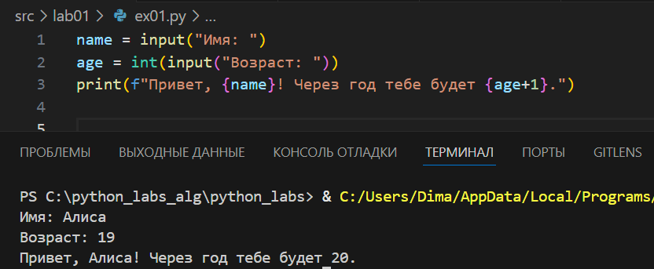
## Задача 2 
```python
a = float(input("a: ").replace(',','.'))
b = float(input("b: ").replace(',','.'))
print (f"sum: {a+b:.2f} avg: {(a+b)/2:.2f}")
```
Возможность вводить числа через запятую реализована с помощью ```replace```
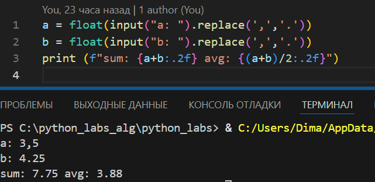
## Задача 3
```python
price = float(input("Цена: "))
discount = float(input("Скидка: "))
vat = float (input("Налог: "))
base = price*(1-(discount/100))
vat_amount = base * (vat/100)
total = base + vat_amount
print(f"База после скидки {base:.2f}")
print(f"НДС {vat_amount:.2f}")
print(f"Итого к оплате {total:.2f}")
```
Округение до 2 знаков реализовано с помощью ```.2f```
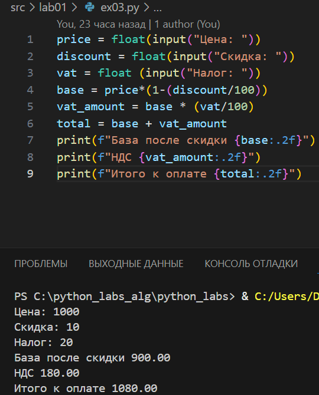 
## Задача 4
```python
m = int(input("Минуты "))
days = 0
if m <1440:
    print(f"{m//60}:{(m%60):02d}")
else:
    while m>1440:
        m-=1440
        days+=1
print(f"{days}\n{m//60}:{(m%60):02d}")
```
Формат времени с впередистоящими нулями реализован через `:02d`

## Задача 5
```python
name, surname, patronymic  = input("ФИО: ").split()
initials = f"{name[0]}.{surname[0]}.{patronymic[0]}."
print(f"Инициалы: {initials}\nДлина: {len(name + surname + patronymic)+2}")
```
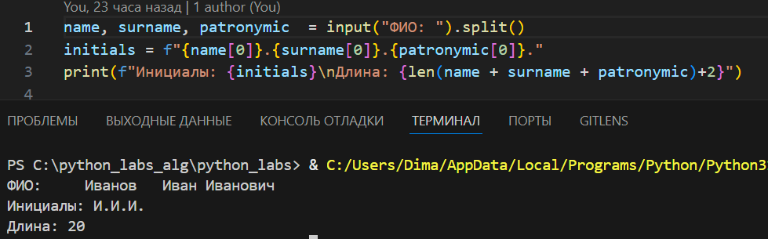
## Задача 6

```python
n = int(input("N: "))
person = 0
online = 0
for i in range(n):
    surname, name, age, form = input().split()
    if form == 'True':
        person+=1
    else:
        online+=1
print(person, online)
```
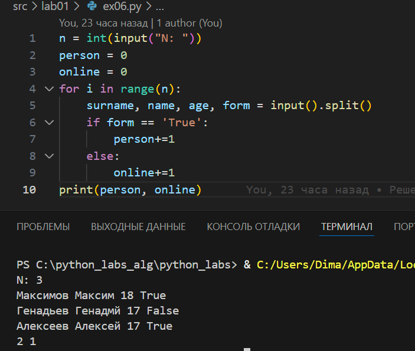
## Задача 7
```python
alphabet_big = "ABCDEFGHIJKLMNOPQRSTUVWXYZ"
alphabet_number = "0123456789"
stroka = input()
no_chiper = str()
k = 0

for i in stroka:
    if i in alphabet_big:
        break
    k += 1 
        
stroka = stroka[k:]
for j in range(len(stroka)):
    if stroka[j] in alphabet_number:
        shag = j+1
        break
for l in range(0, len(stroka), shag):
    no_chiper+=stroka[l]
    
print(no_chiper)

```
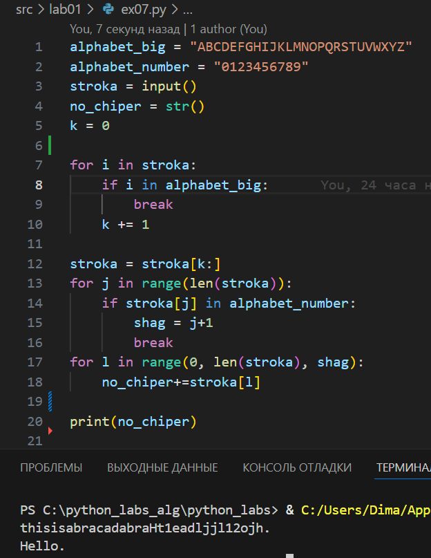


# **Лабораторная работа №2**
## Задача 1(A)
`min_max(nums: list[float | int]) -> tuple[float | int, float | int]`  
   Вернуть кортеж `(минимум, максимум)`. Если список пуст — `ValueError`.
```python
def min_max(nums1):
    if len(nums1) == 0 or [''] == nums1:
        return "ValueError"
    else:
        miimum = min(nums1)
        maximum = max(nums1)
        return (miimum,maximum)
```
Здесь nums1 - готоый список, состоящий из `int` и/или `float` , если же требуется ввод с клавиатуры, то можно сделать так: 
```python
def beauty(x):
    if '.' in x:
        return float(x)
    elif '' == x:
        return x
    else:
        return int(x)


spis = list(input().split(','))
spis = list(map(beauty, spis))
```
Функция сохраняет исходный тип числа `int` или `float` чтобы при выводе могла вохникнуть ситуация `(-3.1, 2)` - `min` и `max` разные типы. Это - для ввода списка таким образом `3, -1 , 5, 5, 0`
Если же мы хотим вводить с клавиатуры именно вот так `[3, -1, 5, 5, 0]` (т.е. используя `[]`  ), то тут поможет функция ```python eval```
Вроде все случаи вводра разобрал, далее они упоминаться не будут
Пример работы `min_max`


Следующая функция 
 `unique_sorted(nums: list[float | int]) -> list[float | int]`  
   Вернуть **отсортированный** список **уникальных** значений (по возрастанию).
```python
def unique_sorted(nums2):
    a = list()
    if nums2 != ['']:
        nums2 = sorted(set(nums2))
        return nums2
    else:
        return a
```
Уникальность добивается `set`
Пример работы `unique_sorted`


Последняя функция `flatten`
```python
def flatten(nums3):
    fl = 0
    spis = list()
    for item in nums3:
        if type(item) == tuple or type(item) == list:

            spis.extend(item)
        elif type(item) == str:
            fl = 1 
            return "TypeError"
        else:
            spis.append(item)
    if fl!=1:
        return spis
```
Пример работы


## Задача 2 (B)
Первая функция
`transpose(mat: list[list[float | int]]) -> list[list]`  
   Поменять строки и столбцы местами. Пустая матрица `[]` → `[]`.  
   Если матрица «рваная» (строки разной длины) — `ValueError`.


```python
def transpose(mat1):
    rez_mat1 = []
    size_stolb = 0
    size_strok = 0 
    try:
        size_strok = len(mat1)
        size_stolb = int(list(map(len,mat1))[0]) 
    except:
        return []
    i = 0
    j = 0
    rvanost = set(map(len,mat1))
    if (len(rvanost) !=1 and mat1!=[]) or type(mat1) == str :
        return "ValueError"
    j = 0
    k = 0
    for k in range(0,size_stolb):
        rez_mat1.append([])
        for j in range(0,size_strok):
            dobavl = mat1[j][k]
            if dobavl != None:
                rez_mat1[k].append(dobavl)
    return rez_mat1
```
Пример работы


Вторая функция
`row_sums(mat: list[list[float | int]]) -> list[float]`  
   Сумма по каждой строке. Требуется прямоугольность (см. выше).

```python
def row_sums(mat2):
    # rez_mat2 = []
    try:
        dlin_strok = set(list(map(len,mat2)))
        # size_strok = len(mat2)
        # size_stolb = int(list(map(len,mat2))[0]) 
    except:
        pass
    # i = 0
    # j = 0
    # dict ={}
    if (len(dlin_strok) !=1 and mat2!=[]) or mat2 == [] or type(mat2) == str:
        return "ValueError"
    else:
        return list(map(sum,mat2))
```


Следующая функция - Сумма по строкам, это просто 2 предыдущие функции
```python
def col_sums(mat3):
    return row_sums(transpose(mat3))
```
Пример выполнения


## Задача 3 (C)
Реализуйте `format_record(rec: tuple[str, str, float]) -> str`
```python
def format_record(rec):
    # rec = list(rec)
    if len(rec) == 3:

        fio = rec[0]
        group = rec[1]
        gpa = rec[2]
    if len(rec)!=3 or group == '':
        return"ValueError"
    if type(fio) == str and type(group) == str and type(gpa) == float:
            try:
                name, surname, patronymic  = fio.split()
            except:
                 fio+=" None"
                 name, surname, patronymic  = fio.split()
            if patronymic == "None":
                 patronymic = ""
            else:
                 patronymic = patronymic[:-4]
            name = name.capitalize()
            surname = surname.capitalize()
            patronymic = patronymic.capitalize()
            if patronymic != '':
                initials = f"{name} {surname[0]}.{patronymic[0]}."
            else:
                 initials = f"{name} {surname[0]}."
    else:
        return "TypeError"
    ans = f"{initials}, гр. {group}, GPA {gpa:.2f}"
    return ans
```

Примеры выполнения программы(доп примеры для показания возможных ошибок)
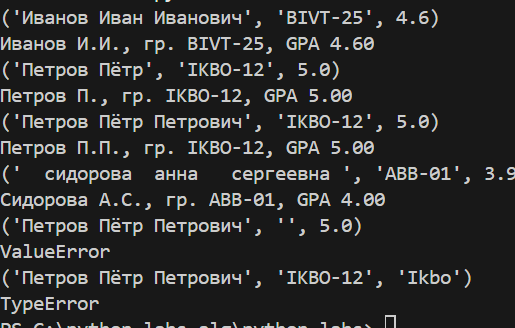

Все функции дополнительно сохранены в lib

# **Лабораторная работа №3**
## Задание A
1. `normalize(text: str, *, casefold: bool = True, yo2e: bool = True) -> str`  
   - Если `casefold=True` — привести к **casefold** (лучше, чем `lower` для Юникода).  
   - Если `yo2e=True` — заменить все `ё`/`Ё` на `е`/`Е`.  
   - Убрать невидимые управляющие символы (например, `\t`, `\r`) → заменить на пробелы, схлопнуть повторяющиеся пробелы в один.

```python
def normalize (text1: str, casefold: bool = True , yo2e:bool = True)-> str:
    if type(text1) != str:
        raise TypeError("Неверный тип данныхх")
    if yo2e:
        text1 = text1.replace('ё','е')
        text1 = text1.replace("Ё","Е")
    
    if casefold:
        text1 = text1.casefold()

    text1 = ' '.join(text1.split())
    text1 = ' '.join(text1.split('\t'))
    text1 = ' '.join(text1.split('\r'))
    text1 = ' '.join(text1.split('\n'))

    return text1
```
Тесты:
```python
a = "ПрИвЕт\nМИр\t"
b = "ёжик, Ёлка"
c = "Hello\r\nWorld"
d = "  двойные   пробелы  "
print(f'Строка:\n{a}\nНормализованная строка:\n{normalize(a)}\nСтрока:\n{b}\nНормализованная строка:\n{normalize(b)}\nСтрока:\n{c}\nНормализованная строка:\n{normalize(c)}\nСтрока:\n{d}\nНормализованная строка:\n{normalize(d)} ')
```

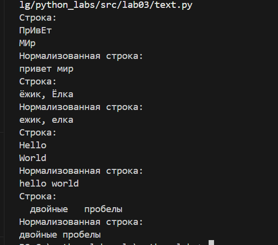

2. `tokenize(text: str) -> list[str]`  
   - Разбить на «слова» по небуквенно-цифровым разделителям.  
   - В качестве слова считаем последовательности символов `\w` (буквы/цифры/подчёркивание) **плюс** дефис внутри слова (например, `по-настоящему`).  
   - Числа (например, `2025`) считаем словами.

```python
def tokenize(text2: str) -> list[str]:
    
    alph1 = ',./~!@#$%^&*()<>}{=+!"№;%:?*()—'
    alph2 = "'"
    alph3 = '_-'
    alph_letters = 'abcdefghijklmnopqrstuvwxyzABCDEFGHIJKLMNOPQRSTUVWXYZАБВГДЕЁЖЗИЙКЛМНОПРСТУФХЦЧШЩЪЫЬЭЮЯабвгдеёжзийклмнопрстуфхцчшщъыьэюя0123456789'
    for i in alph1:
        text2 = text2.replace(i, ' ')
    for j in alph2:
        text2 = text2.replace(j, ' ')
    text2 = [_ for _ in text2]
    for i in range(len(text2)):
        try:
            if (text2[i] in alph3) and (text2[i-1] in alph_letters and text2[i+1] in alph_letters):
                pass
            else:
                if text2[i] in alph3:
                    text2[i] = ' '
        except:
            if text2[i] in alph3:
                text2[i] = ' '
    text2 = ''.join(text2)
    text2 = text2.split()
    i = 0
    for element in text2:
        
        for letter in element:
            if not(letter in alph_letters) and letter not in alph3:
                element = element.replace(letter,'')
                text2[i] = element
        i+=1
    text2 = [i for i in text2 if i!=""]
    return text2

```
Тесты
```python
a = "привет мир"
b = "hello,world!!!"
c = "по-настоящему круто"
d = "2025 год"
e = "emoji 😀 не слово"

print(f'Строка:\n{a}\nОтдельно слова:\n{tokenize(a)}\nСтрока:\n{b}\nОтдельно слова:\n{tokenize(b)}\nСтрока:\n{c}\nОтдельно слова:\n{tokenize(c)}\nСтрока:\n{d}\nОтдельно слова:\n{tokenize(d)}\nСтрока:\n{e}\Отдельно слова:\n{tokenize(e)} ')
```

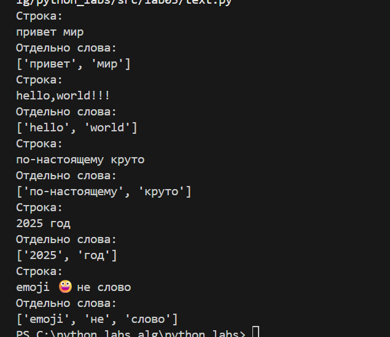

Дополнительные тесты:
```python
a = ""
b = "😀😀😀.ha ha-ha😀😀😀😀😀"
c = "В таком диапазоне: 2020-2025!!!!"
-//-
```

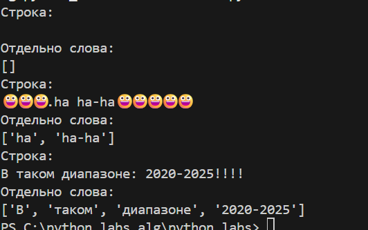

3. `count_freq(tokens: list[str]) -> dict[str, int]`  
   - Подсчитать частоты, вернуть словарь `слово → количество`.
  
```python
def count_freq(tokens: list[str]) -> dict[str, int]:
    ans = dict()
    if type(tokens) != list:
        raise TypeError(f"Не верный тип данных должно быть list, передано {type(tokens)}")
    try:

        if type(tokens[0])!=str:
            raise TypeError(f'"Не верный тип данных должно быть list[str], передано list[{type(tokens[0])}]"')
    except:
        pass

    try:
        type_tokens = set(list(map(type, tokens)))
        if len(set)!=1:
            raise TypeError(f"Внутри списка строки разных типов данных {type_tokens}")
    except:
        pass
    for element in tokens:
        if element not in ans:
            ans.update({element : tokens.count(element)})
    return ans
```

```python
def top_n(freq: dict[str, int], n: int = 5)-> list[tuple[str, int]]:
    if  type(freq) != dict:
        raise TypeError(f'Не верный тип данных должно быть dict, передано {type(freq)}')
    if  type(n) != int:
        raise TypeError(f'Не верный тип данных должно быть int, передано {type(n)}')
    freq = sorted(freq.items(),key=lambda x: (-x[1],x[0]))
    if n >len(freq):
        return freq
    else:
        return freq[:n]
```
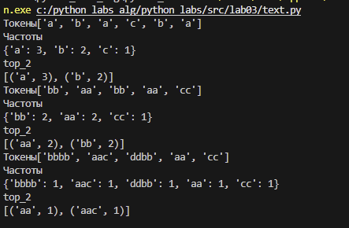

## Задание B*
Находится lab_03 -> text_status.py,
При вводе табличный вывод можно включить, введя `1` stdin или выключить `0` stdin

```python
from text import count_freq, top_n,normalize,tokenize
vhod = input("Введите текст строкой:\n")
fl = int(input("Табличный вывод.\n 0 - выключить \n 1 - включить\n"))
if fl!=0 and fl!=1:
    if type(fl) == int:
        raise ValueError("Нужно 1 или 0")
    else:
        raise TypeError("Нужно int")
vhod_norm = normalize(vhod)
vhod_tokenize = tokenize(vhod_norm)
vhod_freq = count_freq(vhod_tokenize)
top_5 = top_n(vhod_freq,5)
print(f"Всего слов: {len(vhod_tokenize)}\nУникальных слов: {len(count_freq(vhod_tokenize))}\nТоп-5")

len_generator = [len(i[0]) for i in top_5]
max_len = max(len_generator)
if max_len<=5:
    max_len = 5
count_generator = [len(str(i[1])) for i in top_5]
max_count = max(count_generator)
if max_count<=7:
    max_count = 7

if fl == 0:
    for i in top_5:
        slovo, count = i
        print(f"{slovo}:{count}")
else:
    len_generator = [len(i[0]) for i in top_5]
    max_len = max(len_generator)
    if max_len<=5:
        max_len = 5
    count_generator = [len(str(i[1])) for i in top_5]
    max_count = max(count_generator)
    if max_count<=7:
        max_count = 7
    print(f"слово{' '*(max_len-5)}| частота{' '*(max_count-7)}")
    print(f"{"-"*(max_len+max_count+2)}")
    for i in top_5:
        slovo, count = i
        print(f"{slovo}{' '*(max_len-len(slovo))}|{count}")
```
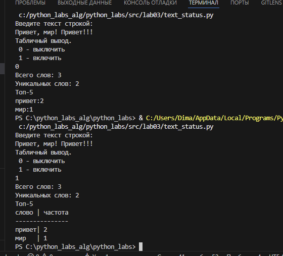

Если все слова маленькие, то табличный вывод такой(| ставится по уровню "слово"):
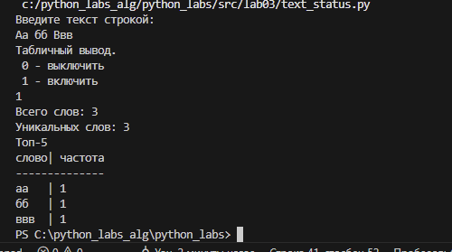

# **Лабортанорная работа №4**

## Задание A
Функции read_text и write_csv в файле src/lab04/io_txt_csv.py
В функцию write_csv добавлена необязательная переменная type_write, понадобилась для удобства записи отчёта нескольких файлов
```python
def write_csv (rows: Iterable[Sequence], path: str | Path, header: tuple[str, ...] | None=None, type_write: str="w" ) -> None:
    """
    Args 
        rows 
            данные, которые будем записывать - тип данных итерируемый объект с элементакми списками/кортежами(последовательностями)
        path
            путь к файлу для записи - str или Path

        header
            Необязательный заголовок, по умолчанию пуст, тип tuple[str,...]
        type_write
            Необязательная переменная - тип записи в функции open, значение по умолчанию "w"
    
    Returns 
        None
        Записывает данные в файл в кодировке utf-8, ничего не возвращает

    Raises
        Неверный тип данных rows TypeError()
        неверный тип данных path TypeError()
        Неверный тип данных header TypeError()
        в rows есть int or str
        в header разные типы данных
        
    """
def read_text (path:str | Path, encoding: str = "utf-8")->str:
    """
    Args
        path - путь к файлу str или Path
        encoding - кодировка, по умолчанию utf-8, возможен выбор других, например cp1251

    Returns
        Содержимое файла как одна строка

    Raises:
        Если файл не найден ошибка FileNotFoundError
        Если кодировка не подходит UnicodeDecodeError
        Если not(isinstance(path,str,Path)), тогда  TypeError("Неверный тип path")
        Если not(isinstance(encoding,str)), тогда TypeError("Неверный тип encoding")
    
    """
```
## Скрипт
По умолчанию информация берётся из файла `data/a.txt`
Записывается в `data/out.csv`
Кодировка по умолчанию `utf-8`
`text_report.py` может принимать 1-n файлов на вход.

Если файл 1 и он пустой, то в `data/out.csv` записывается только заголовок
Если файл один и он не пустой, то `data/out.csv` заполняется по заданию
Если файлов несколько, то создаётся `data/reprot_per_file.csv` и `data/report_total.csv` и заполняются по заданию
Через `--input` можно указать пути входных файлов, пути должны быть разделены пробелами. Пример `--input data/a.txt data/b.txt data/c.txt`
Аналогично можно указать `--output data/out.csv`, если файла или папок по пути нет, то создадутся все родительские папки и этот файл
Также можно указать `--encoding cp1251`(пример), по умолчанию `utf-8`   

При пустом файле будет создан только заголовок word,count.


В файле `a` `Привет вот небольшой текст с повторяющимися словами словами с`

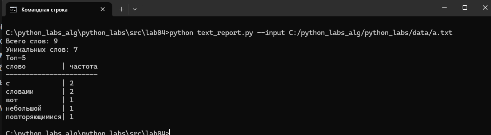

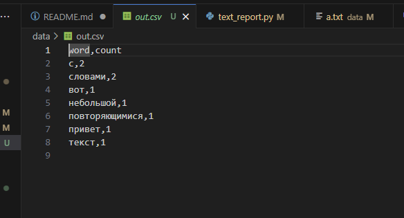

В `а` файле пусто
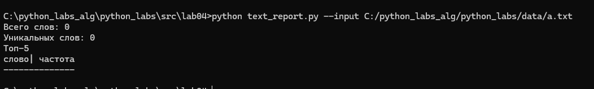
В `out.csv` только заголовок 
В файлах `a` и `b` пусто
- в консоль ничего не выводится, в `report_total.csv` и `report_per_file.csv` записываются только заголовки
 
В файлах  `a` и `b` не пусто
`a.txt`
Солнце светило ярко, птицы пели звонко. Лес был полон жизни, воздух чист и свеж. Мы гуляли долго, наслаждаясь каждым моментом.
`b.txt`
Яркое солнце согревало землю, птицы радостно пели. Лес дышал полной грудью, воздух был наполнен ароматами. Мы шли не спеша, наслаждаясь тишиной.
report_total:
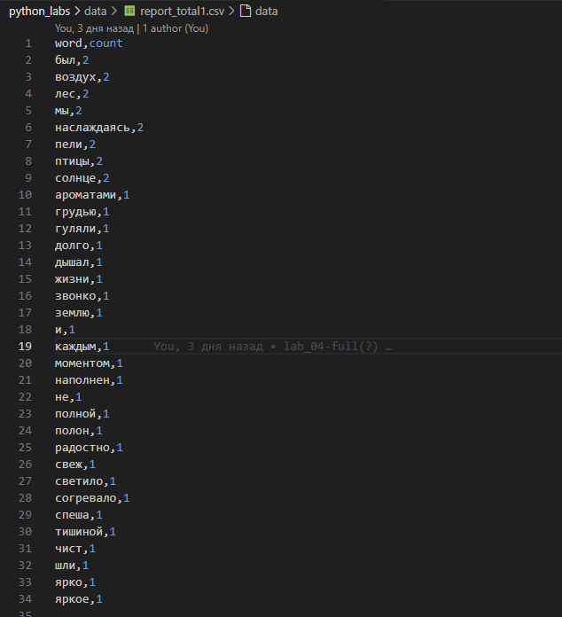

report:per_file:

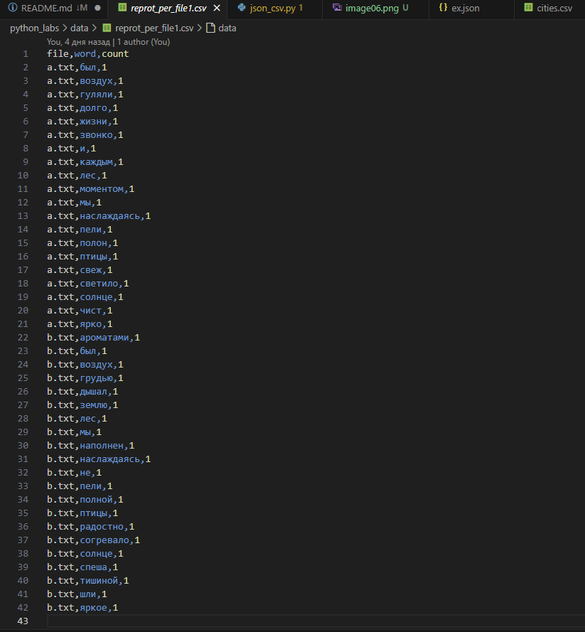

(текст написан нейросетью)
Чтобы при дальнейших запусках пример не потерялся к файлам добвалены `1`
`a.txt`->`a1.txt` и так далее включая `report`

Кодировка cp1251. Текст в нужной кодировке набран с помощью Visual Studio Code,
В файле `input.txt` `Привет` в `cp1251`
Чтобы вывод не затёрся и при проверке его можно было посмотреьть, он хранится в файле `out1.csv`

Вывод программы
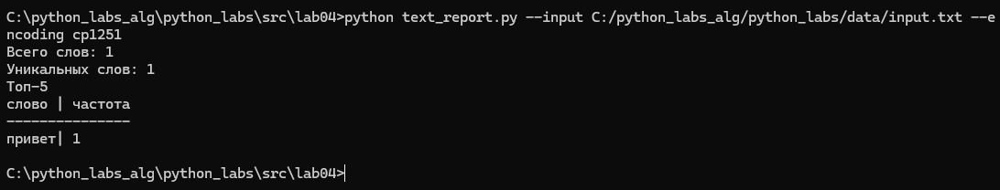

# **Лабораторная работа №5**
Преобразование csv <-> jscon <-> xlsx
Докстринги к функциям
```python
def json_to_csv(json_path: str|Path, csv_path: str|Path) -> None:
    """
    Args
        json_path - путь к файлу str|Path .json из него читаем данные - список словарей
        csv_path - путь к файлу str|Path .csv, файл может не существовать, тодгда создаём все родительские папки и сам файл

    Return
        None
        (Создаёт файл с данными)

    Raises
        TypeError(f"json_path неправильнвй тип. Ожидается str|Path, передан {type(json_path)}")
        TypeError(f"csv_path неправильнвй тип. Ожидается str|Path, передан {type(csv_path)}")
        FileNotFoundError("Файл не найден")
        raise json.JSONDecodeError(f"Ошибка чтения файла")

    
    Преобразует JSON-файл в CSV.
    Поддерживает список словарей [{...}, {...}], заполняет отсутствующие поля пустыми строками.
    Кодировка UTF-8. Порядок колонок - алфавитный (указать в README).
    """
    

def csv_to_json(csv_path: str|Path, json_path:str|Path) -> None:
    """
    Args
        csv_path - путь к файлу str|Path .csv из него читаем данные
        json_path - путь к файлу str|Path .json, файл может не существовать, тогда создаём все родительские папки и сам файл

    Return
        None
        (Создаёт файл с данными)

    Raises
        TypeError(f"json_path неправильный тип. Ожидается str|Path, передан {type(json_path)}")
        TypeError(f"csv_path неправильный тип. Ожидается str|Path, передан {type(csv_path)}")
        FileNotFoundError("Файл не найден")
        ValueError("Пустой заголовок")
        ValueError("CSV файл содержит дублирующиеся заголовки")
        ValueError("Не удалось прочитать csv файл")
        ValueError("Пустой файл")
        ValueError("Не удалось записать json")

    Преобразует CSV в JSON (список словарей).
    Заголовок обязателен, значения сохраняются как строки.
    json.dump(..., ensure_ascii=False, indent=2)
    """


def csv_to_xlsx(csv_path: str|Path, xlsx_path: str|Path) -> None:
    """
     Args
        csv_path - путь к файлу str|Path .csv из него читаем данные
        xlsx_path - путь к файлу str|Path .xlsx, файл может не существовать, тогда создаём все родительские папки и сам файл

    Return
        None
        (Создаёт файл с данными)

    Raises
        FileNotFoundError(f"CSV файл не найден: {csv_path}")
        ValueError(f"Ошибка чтения CSV файла: {csv_path}")

    Конвертирует CSV в XLSX.
    Использовать openpyxl ИЛИ xlsxwriter.
    Первая строка CSV — заголовок.
    Лист называется "Sheet1".
    Колонки — автоширина по длине текста (не менее 8 символов).
    """
```
Все файлы из data/samples переведены в другие форматы и находятся в data/samples/result
Из интересного
-Авто ширина строк(Exel ругается на запись числе в виде текста)
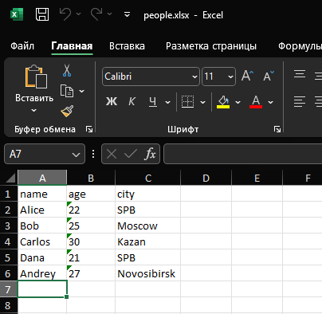

-Числа, которые были числами в csv записались как строки в json, что логично
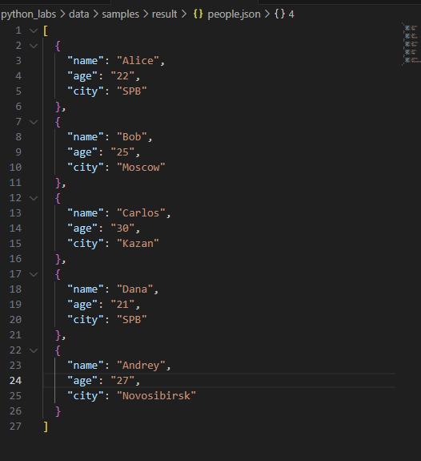
-Запись в csv меняет порядок колонок на алфавитный(решено мной, указано в докстринге)
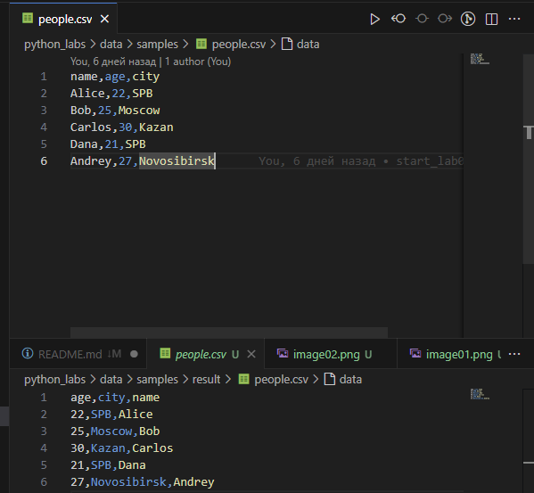

Сваой пример. Создан файл \dara\samples\vegetables.csv
Из интересного - ширина в Exel не очень коректно отображается. При максимальной длине записи Центральная Россия (длина 18), устанавливается соответствующая длина 18. Но значения всё равно вылазят за пределы(видно на скрине)


А так выглядит в json(на скрине не весь файл)

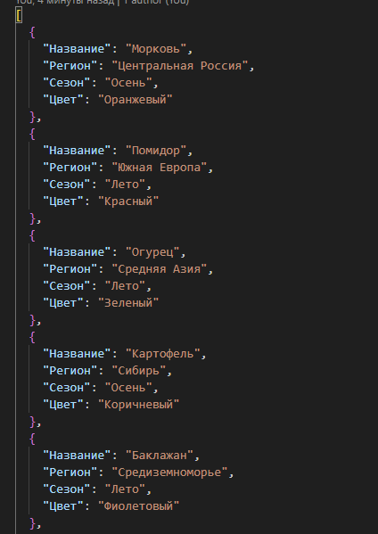

# **Лабораторная работа №6**
Скрипт `cli_text.py`
```python
def main():
    parser = argparse.ArgumentParser(description="CLI‑утилиты лабораторной №6")
    subparsers = parser.add_subparsers(dest="command")

    # подкоманда cat
    cat_parser = subparsers.add_parser("cat", help="Вывести содержимое файла")
    cat_parser.add_argument("--input", required=True)
    cat_parser.add_argument("-n", action="store_true", help="Нумеровать строки")

    # подкоманда stats
    stats_parser = subparsers.add_parser("stats", help="Частоты слов")
    stats_parser.add_argument("--input", required=True)
    stats_parser.add_argument("--top", type=int, default=5)

    args = parser.parse_args()

    if args.command == "cat":
        cat_input = args.input
        cat_n = args.n
        i_stroka = 1
        cat_input = Path(cat_input)
        if not(cat_input.exists()):
            raise FileNotFoundError('Файл не найден')
        try:
            with cat_input.open('r',encoding = 'utf-8') as d:
                if cat_n:
                    for line in d.readlines():
                        print(f'{i_stroka} строка: {line}',end='')
                        i_stroka+=1
                else:
                    for line in d.readlines():
                        print(f'{line}',end='')
        except:
            raise UnicodeDecodeError('Не удалось прочитать файл')
            """ Реализация команды cat """
    elif args.command == "stats":
        stars_input = args.input
        stats_top_n = args.top
        stars_input = Path(stars_input)
        if not(stars_input.exists()):
            raise FileNotFoundError(f"Файл не найден по пути {stars_input}")
        try:
            text = read_text(path= stars_input)
        except:
            raise UnicodeEncodeError("Ошибка чтения файла")
        if not(type(stats_top_n) == int):
            raise TypeError(f"Ошибка type(n) = {type(stats_top_n)}, а должен быть int")

        text_normalize = normalize(text)
        text_tokenize = tokenize(text_normalize)
        text_freq = count_freq(text_tokenize)
        text_top = top_n(text_freq,stats_top_n)
        print('word','count')
        for word, count in text_top:
            print(word,count)
        """ Реализация команды stats """

```

Скрипт `cli_convert.py`
```python
def main():
    parser = argparse.ArgumentParser(description="Конвертеры данных")
    sub = parser.add_subparsers(dest="cmd")

    p1 = sub.add_parser("json2csv",help="Конвертировать JSON в CSV")
    p1.add_argument("--input", dest="input", required=True,help="Путь к входному JSON файлу")
    p1.add_argument("--out", dest="output", required=True,help="Путь для сохранения CSV файла")

    p2 = sub.add_parser("csv2json",help="Конвертировать CSV в JSON")
    p2.add_argument("--input", dest="input", required=True,help="Путь к входному CSV файлу (с заголовком в первой строке)")
    p2.add_argument("--out", dest="output", required=True,help="Путь для сохранения JSON файла")

    p3 = sub.add_parser("csv2xlsx", help="Конвертировать CSV в XLSX")
    p3.add_argument("--input", dest="input", required=True,help="Путь к входному CSV файлу")
    p3.add_argument("--out", dest="output", required=True,help="Путь для сохранения XLSX файла")

    args = parser.parse_args()

    """
        Вызываем код в зависимости от аргументов.
    """
    if args.cmd == "json2csv":
        path_in = args.input
        path_ou = Path(args.out)
        json_to_csv(path_in,path_ou)


    elif args.cmd == "csv2json":
        path_in = args.input
        path_ou = Path(args.out)
        csv_to_json(path_in,path_ou)


    elif args.cmd =='csv2xlsx':
        path_in = args.input
        path_ou = Path(args.out)
        csv_to_xlsx(path_in,path_ou)
```

Вызов команды help для `convert` и`text`

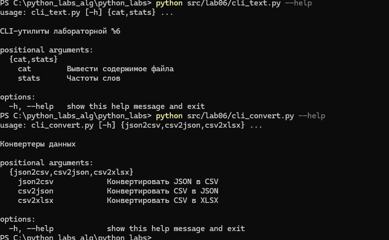

Пример работы `cat`
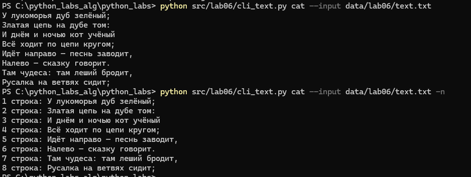

Пример рабоы `stats`


Запус всех трёх функций `cli_convert.py`

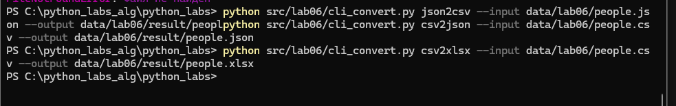

Результаты

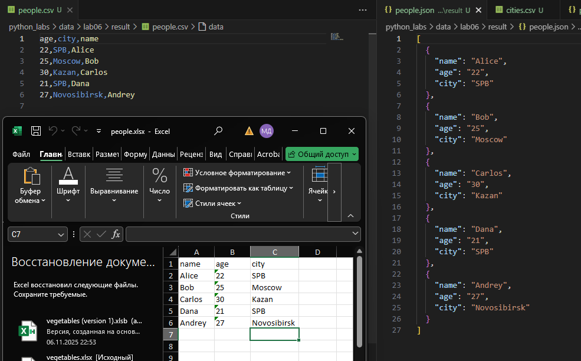

# **Лабораторная работа №7**
Тесты для `normalize, tokenize, count_freq, top_n`
```python
import pytest
from src.lib.text import normalize, tokenize, count_freq, top_n


# Тесты для normalize
@pytest.mark.parametrize(
    "source, expected",
    [
        ("ПрИвЕт\nМИр\t", "привет мир"),
        ("ёжик, Ёлка", "ежик, елка"),
        ("Hello\r\nWorld", "hello world"),
        ("  двойные   пробелы  ", "двойные пробелы"),
        ("", ""),
        ("   ", ""),
        ("ЁЖИК-ЁЖ", "ежик-еж"),
    ],
)
def test_normalize_basic(source, expected):
    assert normalize(source) == expected


def test_normalize_without_yo2e():
    result = normalize("ёжик", yo2e=False)
    assert "ё" in result


# Тесты для tokenize
@pytest.mark.parametrize(
    "source, expected",
    [
        ("привет мир", ["привет", "мир"]),
        ("hello,world!!!", ["hello", "world"]),
        ("по-настоящему круто", ["по-настоящему", "круто"]),
        ("2025 год", ["2025", "год"]),
        ("emoji 😀 не слово", ["emoji", "не", "слово"]),
        ("", []),
        ("!!!", []),
        ("word1 word2-word3", ["word1", "word2-word3"]),
    ],
)
def test_tokenize_basic(source, expected):
    assert tokenize(source) == expected


# Тесты для count_freq
def test_count_freq_basic():
    tokens = ["a", "b", "a", "c", "b", "a"]
    result = count_freq(tokens)
    expected = {"a": 3, "b": 2, "c": 1}
    assert result == expected


def test_count_freq_empty():
    assert count_freq([]) == {}


def test_count_freq_single_word():
    assert count_freq(["test"]) == {"test": 1}


def test_count_freq_case_sensitive():
    tokens = ["Word", "word", "WORD"]
    result = count_freq(tokens)
    assert result["Word"] == 1
    assert result["word"] == 1
    assert result["WORD"] == 1


# Тесты для top_n
def test_top_n_basic():
    freq = {"a": 3, "b": 2, "c": 1}
    result = top_n(freq, 2)
    expected = [("a", 3), ("b", 2)]
    assert result == expected


def test_top_n_tie_breaker():
    freq = {"bb": 2, "aa": 2, "cc": 1}
    result = top_n(freq, 2)
    expected = [("aa", 2), ("bb", 2)]
    assert result == expected


def test_top_n_more_than_available():
    freq = {"a": 3, "b": 2}
    result = top_n(freq, 5)
    expected = [("a", 3), ("b", 2)]
    assert result == expected

```
Тесты для `json_to_csv, csv_to_json`

```python
import pytest
import json
import csv
from pathlib import Path
from src.lab05.json_csv import json_to_csv, csv_to_json


def test_json_to_csv_basic_conversion(tmp_path):
    """Позитивный тест: корректная конвертация JSON → CSV"""
    src_json = tmp_path / "test.json"
    test_data = [
        {"name": "Alice", "age": 22, "city": "Moscow"},
        {"name": "Bob", "age": 25, "city": "SPb"},
    ]

    src_json.write_text(json.dumps(test_data, ensure_ascii=False), encoding="utf-8")

    dst_csv = tmp_path / "test.csv"
    json_to_csv(str(src_json), str(dst_csv))

    assert dst_csv.exists()

    with open(dst_csv, "r", encoding="utf-8") as f:
        reader = csv.DictReader(f)
        rows = list(reader)

    assert len(rows) == len(test_data)
    assert set(rows[0].keys()) == {"name", "age", "city"}
    assert rows[0]["name"] == "Alice"
    assert rows[0]["age"] == "22"
    assert rows[1]["name"] == "Bob"


def test_csv_to_json_basic_conversion(tmp_path):
    """Позитивный тест: корректная конвертация CSV → JSON"""
    src_csv = tmp_path / "test.csv"

    with open(src_csv, "w", encoding="utf-8", newline="") as f:
        writer = csv.DictWriter(f, fieldnames=["name", "age", "city"])
        writer.writeheader()
        writer.writerow({"name": "Alice", "age": "22", "city": "Moscow"})
        writer.writerow({"name": "Bob", "age": "25", "city": "SPb"})

    dst_json = tmp_path / "test.json"
    csv_to_json(str(src_csv), str(dst_json))

    assert dst_json.exists()

    with open(dst_json, "r", encoding="utf-8") as f:
        data = json.load(f)

    assert len(data) == 2
    assert set(data[0].keys()) == {"name", "age", "city"}
    assert data[0]["name"] == "Alice"
    assert data[0]["age"] == "22"
    assert data[1]["name"] == "Bob"


def test_json_to_csv_preserves_all_fields(tmp_path):
    """Тест: все поля сохраняются при конвертации"""
    src_json = tmp_path / "test.json"
    test_data = [
        {"name": "Alice", "age": 22, "city": "Moscow", "email": "alice@test.com"},
        {"name": "Bob", "age": 25, "city": "SPb"}, 
    ]

    src_json.write_text(json.dumps(test_data, ensure_ascii=False), encoding="utf-8")

    dst_csv = tmp_path / "test.csv"
    json_to_csv(str(src_json), str(dst_csv))

    with open(dst_csv, "r", encoding="utf-8") as f:
        reader = csv.DictReader(f)
        rows = list(reader)

    assert set(rows[0].keys()) == {"name", "age", "city", "email"}
    assert rows[1]["email"] == ""


def test_csv_to_json_preserves_string_values(tmp_path):
    """Тест: значения сохраняются как строки"""
    src_csv = tmp_path / "test.csv"
    with open(src_csv, "w", encoding="utf-8", newline="") as f:
        writer = csv.DictWriter(f, fieldnames=["id", "name", "score"])
        writer.writeheader()
        writer.writerow({"id": "001", "name": "Alice", "score": "95.5"})

    dst_json = tmp_path / "test.json"
    csv_to_json(str(src_csv), str(dst_json))

    with open(dst_json, "r", encoding="utf-8") as f:
        data = json.load(f)

    assert data[0]["id"] == "001"
    assert data[0]["name"] == "Alice"
    assert data[0]["score"] == "95.5"


def test_json_to_csv_roundtrip(tmp_path):
    """Тест полного цикла: JSON → CSV → JSON"""
    original_data = [
        {"name": "Alice", "age": 22, "active": True},
        {"name": "Bob", "age": 25, "active": False},
    ]

    json1 = tmp_path / "original.json"
    csv_file = tmp_path / "converted.csv"
    json2 = tmp_path / "final.json"

    json1.write_text(json.dumps(original_data, ensure_ascii=False), encoding="utf-8")
    json_to_csv(str(json1), str(csv_file))
    csv_to_json(str(csv_file), str(json2))

    with open(json2, "r", encoding="utf-8") as f:
        final_data = json.load(f)

    assert len(final_data) == len(original_data)
    assert final_data[0]["name"] == original_data[0]["name"]
    assert final_data[1]["name"] == original_data[1]["name"]


def test_json_to_csv_invalid_json(tmp_path):
    """Негативный тест: некорректный JSON"""
    src_json = tmp_path / "invalid.json"
    src_json.write_text("{invalid json}", encoding="utf-8")

    dst_csv = tmp_path / "output.csv"

    with pytest.raises(Exception):
        json_to_csv(str(src_json), str(dst_csv))


def test_json_to_csv_not_list_structure(tmp_path):
    """Негативный тест: JSON не является списком словарей"""
    src_json = tmp_path / "not_list.json"
    src_json.write_text('{"name": "Alice"}', encoding="utf-8")

    dst_csv = tmp_path / "output.csv"

    with pytest.raises(TypeError):
        json_to_csv(str(src_json), str(dst_csv))


def test_json_to_csv_file_not_found():
    """Негативный тест: исходный JSON файл не существует"""
    with pytest.raises(FileNotFoundError):
        json_to_csv("nonexistent.json", "output.csv")


def test_csv_to_json_file_not_found():
    """Негативный тест: исходный CSV файл не существует"""
    with pytest.raises(FileNotFoundError):
        csv_to_json("nonexistent.csv", "output.json")

```
Часть результатов теста для pytest
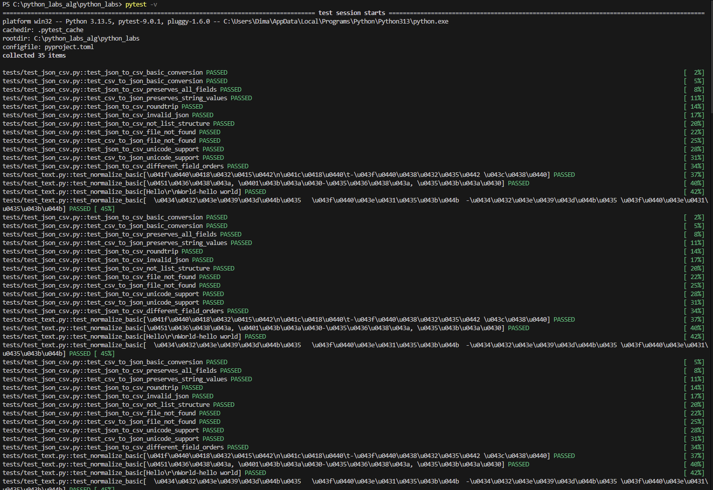

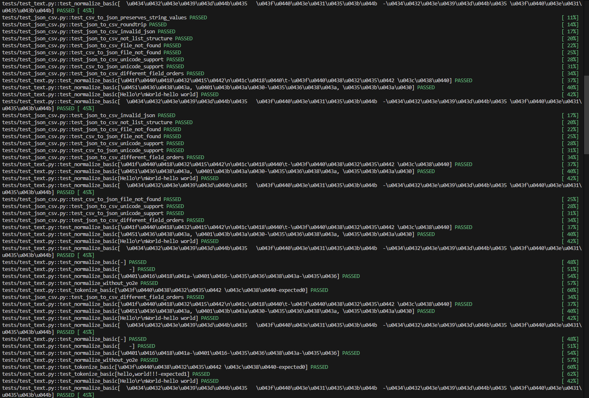

Результат для `pytest --cov=src cov-report=term-missing`

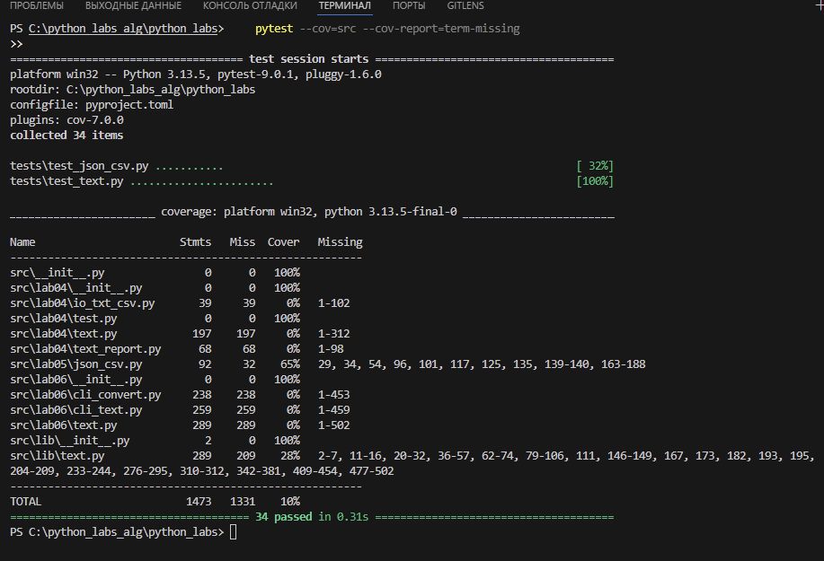

`io_txt_csv.py` - скрипт, `text_report.py` - скрипт, json_csv - некоторые ошибки (неверный путь) не покрыты, `cli_convert` - скрипт `cli_text` - скрипт
Последний файл содержит функции из предыдущих лабораторных (функции работы с матрицами и тд) их тесты не заданы.
`black`  - структура всех файлов верна
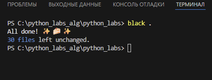
