# ** Лабораторная работа №1**
### Задача 1
```python
name = input("Имя: ")
age = int(input("Возраст: "))
print(f"Привет, {name}! Через год тебе будет {age+1}.")
```
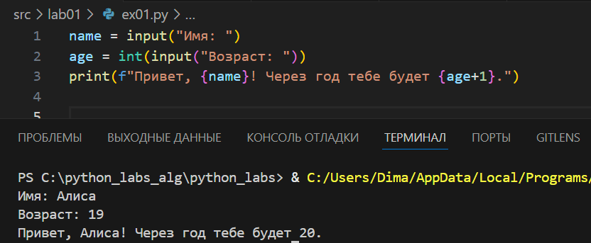
### Задача 2 
```python
a = float(input("a: ").replace(',','.'))
b = float(input("b: ").replace(',','.'))
print (f"sum: {a+b:.2f} avg: {(a+b)/2:.2f}")
```
Возможность вводить числа через запятую реализована с помощью ```replace```
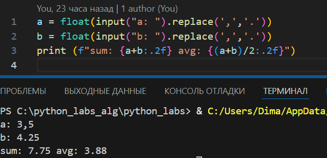
### Задача 3
```python
price = float(input("Цена: "))
discount = float(input("Скидка: "))
vat = float (input("Налог: "))
base = price*(1-(discount/100))
vat_amount = base * (vat/100)
total = base + vat_amount
print(f"База после скидки {base:.2f}")
print(f"НДС {vat_amount:.2f}")
print(f"Итого к оплате {total:.2f}")
```
Округение до 2 знаков реализовано с помощью ```.2f```
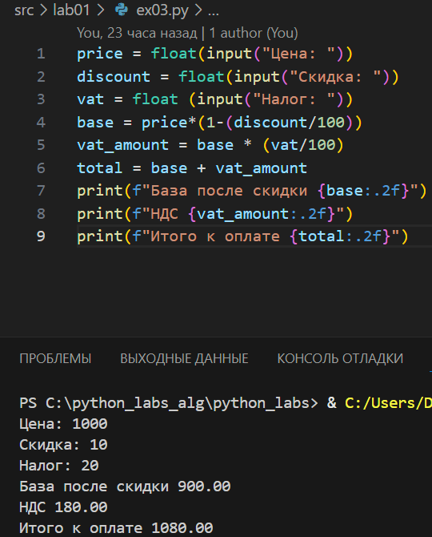 
### Задача 4
```python
m = int(input("Минуты "))
days = 0
if m <1440:
    print(f"{m//60}:{(m%60):02d}")
else:
    while m>1440:
        m-=1440
        days+=1
print(f"{days}\n{m//60}:{(m%60):02d}")
```
Формат времени с впередистоящими нулями реализован через `:02d`
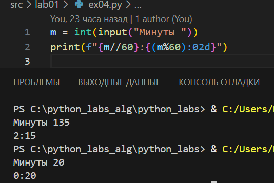
### Задача 5
```python
name, surname, patronymic  = input("ФИО: ").split()
initials = f"{name[0]}.{surname[0]}.{patronymic[0]}."
print(f"Инициалы: {initials}\nДлина: {len(name + surname + patronymic)+2}")
```
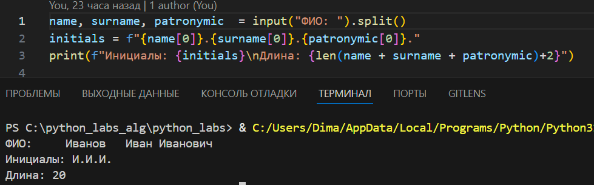
### Задача 6

```python
n = int(input("N: "))
person = 0
online = 0
for i in range(n):
    surname, name, age, form = input().split()
    if form == 'True':
        person+=1
    else:
        online+=1
print(person, online)
```
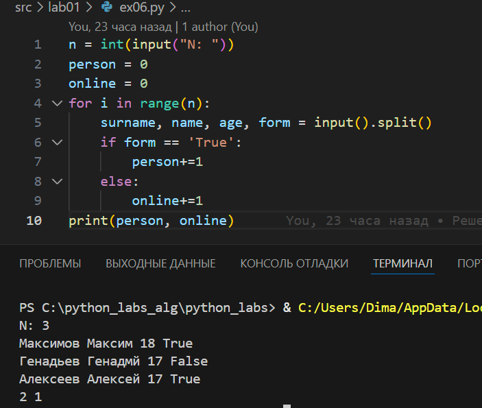
### Задача 7
```python
alphabet_big = "ABCDEFGHIJKLMNOPQRSTUVWXYZ"
alphabet_number = "0123456789"
stroka = input()
no_chiper = str()
k = 0

for i in stroka:
    if i in alphabet_big:
        break
    k += 1 
        
stroka = stroka[k:]
for j in range(len(stroka)):
    if stroka[j] in alphabet_number:
        shag = j+1
        break
for l in range(0, len(stroka), shag):
    no_chiper+=stroka[l]
    
print(no_chiper)

```
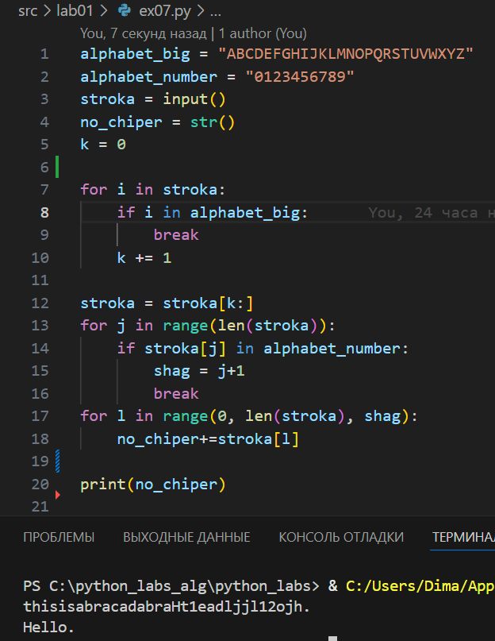


# ** Лабораторная работа №2 **
### Задача 1(A)
`min_max(nums: list[float | int]) -> tuple[float | int, float | int]`  
   Вернуть кортеж `(минимум, максимум)`. Если список пуст — `ValueError`.
```python
def min_max(nums1):
    if len(nums1) == 0 or [''] == nums1:
        return "ValueError"
    else:
        miimum = min(nums1)
        maximum = max(nums1)
        return (miimum,maximum)
```
Здесь nums1 - готоый список, состоящий из `int` и/или `float` , если же требуется ввод с клавиатуры, то можно сделать так: 
```python
def beauty(x):
    if '.' in x:
        return float(x)
    elif '' == x:
        return x
    else:
        return int(x)


spis = list(input().split(','))
spis = list(map(beauty, spis))
```
Функция сохраняет исходный тип числа `int` или `float` чтобы при выводе могла вохникнуть ситуация `(-3.1, 2)` - `min` и `max` разные типы. Это - для ввода списка таким образом `3, -1 , 5, 5, 0`
Если же мы хотим вводить с клавиатуры именно вот так `[3, -1, 5, 5, 0]` (т.е. используя `[]`  ), то тут поможет функция ```python eval```
Вроде все случаи вводра разобрал, далее они упоминаться не будут
Пример работы `min_max`
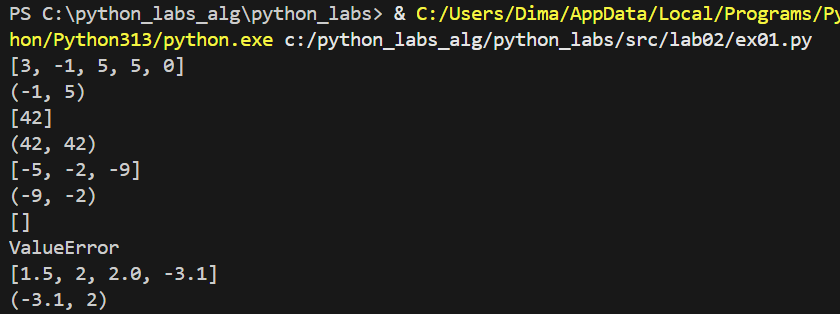

Следующая функция 
 `unique_sorted(nums: list[float | int]) -> list[float | int]`  
   Вернуть **отсортированный** список **уникальных** значений (по возрастанию).
```python
def unique_sorted(nums2):
    a = list()
    if nums2 != ['']:
        nums2 = sorted(set(nums2))
        return nums2
    else:
        return a
```
Уникальность добивается `set`
Пример работы `unique_sorted`

Последняя функция `flatten`
```python
def flatten(nums3):
    fl = 0
    spis = list()
    for item in nums3:
        if type(item) == tuple or type(item) == list:

            spis.extend(item)
        elif type(item) == str:
            fl = 1 
            return "TypeError"
        else:
            spis.append(item)
    if fl!=1:
        return spis
```
Пример работы
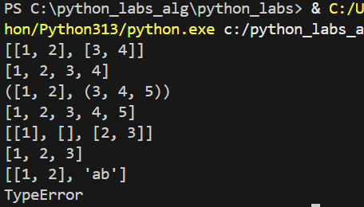
### Задача 2 (B)
Первая функция
`transpose(mat: list[list[float | int]]) -> list[list]`  
   Поменять строки и столбцы местами. Пустая матрица `[]` → `[]`.  
   Если матрица «рваная» (строки разной длины) — `ValueError`.


```python
def transpose(mat1):
    rez_mat1 = []
    size_stolb = 0
    size_strok = 0 
    try:
        size_strok = len(mat1)
        size_stolb = int(list(map(len,mat1))[0]) 
    except:
        return []
    i = 0
    j = 0
    rvanost = set(map(len,mat1))
    if (len(rvanost) !=1 and mat1!=[]) or type(mat1) == str :
        return "ValueError"
    j = 0
    k = 0
    for k in range(0,size_stolb):
        rez_mat1.append([])
        for j in range(0,size_strok):
            dobavl = mat1[j][k]
            if dobavl != None:
                rez_mat1[k].append(dobavl)
    return rez_mat1
```
Пример работы
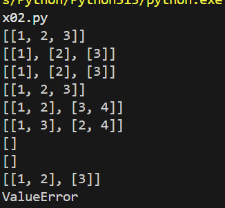
Вторая функция
`row_sums(mat: list[list[float | int]]) -> list[float]`  
   Сумма по каждой строке. Требуется прямоугольность (см. выше).

```python
def row_sums(mat2):
    # rez_mat2 = []
    try:
        dlin_strok = set(list(map(len,mat2)))
        # size_strok = len(mat2)
        # size_stolb = int(list(map(len,mat2))[0]) 
    except:
        pass
    # i = 0
    # j = 0
    # dict ={}
    if (len(dlin_strok) !=1 and mat2!=[]) or mat2 == [] or type(mat2) == str:
        return "ValueError"
    else:
        return list(map(sum,mat2))
```
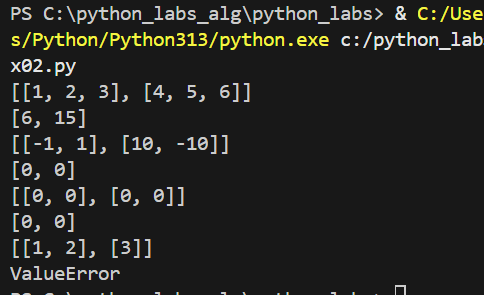
Следующая функция - Сумма по строкам, это просто 2 предыдущие функции
```python
def col_sums(mat3):
    return row_sums(transpose(mat3))
```
Пример выполнения
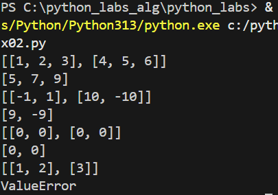


### Задача 3 (C)
Реализуйте `format_record(rec: tuple[str, str, float]) -> str`
```python
def format_record(rec):
    # rec = list(rec)
    if len(rec) == 3:

        fio = rec[0]
        group = rec[1]
        gpa = rec[2]
    if len(rec)!=3 or group == '':
        return"ValueError"
    if type(fio) == str and type(group) == str and type(gpa) == float:
            try:
                name, surname, patronymic  = fio.split()
            except:
                 fio+=" None"
                 name, surname, patronymic  = fio.split()
            if patronymic == "None":
                 patronymic = ""
            else:
                 patronymic = patronymic[:-4]
            name = name.capitalize()
            surname = surname.capitalize()
            patronymic = patronymic.capitalize()
            if patronymic != '':
                initials = f"{name} {surname[0]}.{patronymic[0]}."
            else:
                 initials = f"{name} {surname[0]}."
    else:
        return "TypeError"
    ans = f"{initials}, гр. {group}, GPA {gpa:.2f}"
    return ans
```
Примеры выполнения программы(доп примеры для показания возможных ошибок)

Все функции дополнительно сохранены в lib
